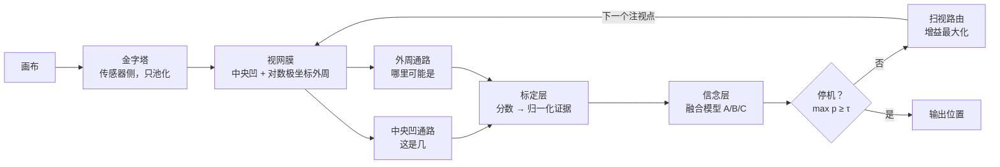

# SaccadeNet V0 方案汇总

> 赛道二：学习、探索、研究并尝试设计一个神经网络（56 小时数学建模黑客松）
> 版本：V0.1（吸收第二轮评审，变更见下）｜整理日期：2026-09-25
> 用法：§0 给人看（通俗版）；§4 起给实现看（规格），可以直接交给 Codex。

## V0.1 变更摘要

- 候选视图改为从视网膜输出反投影得到，不再额外读取金字塔（§4.2、§4.3、§13）。
- 实验职责重新划分：图 4、图 5 只由 Level 2 承担；Level 1 只验证融合与策略，并加入"已知候选、全部裁高清"的公平基线（§2、§8）。
- 新增"粗到细两阶段"强基线：先缩小找候选，再只对候选裁高清（§6、§7、§8）。
- 模型 B 措辞改为"在嵌套高斯观测假设下精确"，是否成立由协方差诊断检验（§5.4）。
- 扫视增益改称"预期辨别力增益（ELM 式）"，不再叫信息增益（§5.5）。
- P0 收窄为：V0-lite + Level 2 的 E1 + 三条基线 + 图 4、图 5（§14）。

## 目录

0. 一页看懂
1. 核心命题、题目与电梯陈述
2. 任务定义与实验阶梯
3. 目标与非目标
4. 网络结构（V0）
5. 数学模型
6. 成本记账规则
7. 与已有工作的区别
8. 实验设计
9. 图表清单
10. 演示方案
11. 事前验尸
12. 56 小时排期
13. 代码结构与接口
14. 需求分级与验收标准
15. 待定问题
16. 决策记录
17. 术语对照表
- 附录 A：选题过程
- 附录 B：赛道背景与撞车基准
- 附录 C：参考文献

---

## 0. 一页看懂

**问题。** 画面越清晰，AI 就必须"想"得越多吗？今天的视觉模型把图像切成小方块，每一块都认真处理。16K 一帧约 1.33 亿像素，按 14×14 切块约 68 万块；Transformer 还要让每一块和其他每一块比较，计算量随块数的平方增长。于是只剩两条路：要么慢（全分辨率硬算），要么瞎（先缩小再看，小细节直接消失）。

**人眼的办法。** 只有视线正中约 2° 视角是清楚的（伸直手臂时大约一个拇指指甲那么大），越往外越糊。眼睛每秒跳约 3 次，大脑把几眼拼成"我看清了整个世界"的感觉。视网膜在眼球里就把约 1.26 亿个感光细胞的信号压进约 100 万根视神经纤维。大脑高效的原因不是算得快，而是大部分地方根本不细看。

**我们做什么。** 把这套办法做成一个神经网络 SaccadeNet，并用数学和实验证明：它每一眼的"思考"计算量几乎不随分辨率增长，而且知道下一眼该看哪、什么时候可以停。一局是这样的：

1. **视网膜**：以注视点为中心取一块 96×96 的清晰区域（中央凹）；外围按飞镖盘的方式取样，越往外格子越大、越糊。
2. **两条识别通路**：中央凹读清楚"这是几"；外周判断"哪里可能是目标"。
3. **信念图**：一张"目标在哪"的概率地图，每看一眼用贝叶斯公式更新。看得清的证据分量重，看得糊的分量轻。
4. **扫视**：下一眼选"预计能带来最多新信息"的位置，有时是两个候选之间。
5. **停止**：某个位置的概率超过阈值 τ（默认 95%）就停。

**要拿出的东西。** 两张核心图：思考计算量 vs 分辨率（全分辨率一路飙升，我们几乎持平）；准确率 vs 分辨率（先缩小再看在 4K–8K 之间崩，我们不掉）。外加支撑它们的推导。两张图都在"候选要自己找"的设定下做，并且和"先缩小找候选、再放大看细节"的方法同台比较。

**一句话：不是学会看，而是推理出看哪。**

---

## 1. 核心命题、题目与电梯陈述

- **中文题目**：看得更清楚，就必须想得更多吗？——SaccadeNet：一个贝叶斯注视点神经网络
- **英文题目**：Does Seeing More Pixels Require Thinking More? SaccadeNet: A Bayesian Foveated Neural Network for Resolution-Scalable Visual Search
- **口号**：不是学会看，而是推理出看哪（Not learning to look, but reasoning where to look）

**核心假设**：分辨率（或视野）扩大 ⇏ 高级语义计算同比扩大。

- 均匀处理：CNN 的 C_semantic ∝ W·H；全局注意力 ∝ (W·H)²。
- SaccadeNet：C_semantic ≈ T·C_g，每一眼成本 C_g 几乎不随分辨率增长，注视次数 T 的规律分三档（§5.7）。

**不宣称的东西**（答辩时主动说清）：
- 不宣称摄像头少接收了像素：我们省的是"思考"，不是"感知"（§6）。
- 不宣称首次提出"只细看局部"，也不宣称首次让每一眼成本随 log R 增长：RAM（2014）已经做到（§7）。
- 不把"类脑"本身当创新：创新落在推导出的计算模型和可检验的扩展规律上。
- 不宣称胜过所有"先粗看、再放大"的方法：粗到细两阶段同样能让语义算力不随分辨率增长，它和我们同属"主动看"这一类；两者的区别在 §7、§8 单独比较。

**30 秒电梯陈述**（数字以实测为准）：
> 16K 画面让多模态大模型等几十秒，因为它把 1.3 亿个像素一视同仁。人眼不这样：只有指甲盖大小的地方是清楚的，其余靠扫视和推理。我们从人眼的解剖规律推导出采样方式，用贝叶斯公式决定下一眼看哪、什么时候停，做成一个只需训练一两个小 CNN 的网络。分辨率从 1080p 涨到 16K、像素多了 64 倍，它每一眼的输入只多不到三成，准确率不掉；而先缩小再看的方法在 4K 到 8K 之间就瞎了。

---

## 2. 任务定义与实验阶梯

合成的"大图找小细节"视觉搜索任务：

| 项 | 设定 |
|---|---|
| 画布 | 1920×1080、3840×2160、7680×4320、15360×8640（1080p / 4K / 8K / 16K），RGB |
| 背景 | 近似 1/f 噪声（多尺度随机网格上采样叠加），中灰；参数：对比度 |
| 卡片 | K 张（默认 12），192×192 像素，浅色高对比（保证外周远处也能以"亮斑"被发现），中心间距 ≥ 288 像素 |
| 数字 | MNIST 数字放大到 48×48，印在卡片中心（±4 像素抖动） |
| 目标 | 给定查询数字 c*，画布上恰好一张卡片是 c*，其余卡片是其他数字 |
| 相似度旋钮 c ∈ [0,1] | 目标卡与干扰卡的颜色差按 c 缩放；c = 0 时颜色相同。需要 P1 的颜色通道才能被利用 |
| 卡片开关 | 关闭时数字直接印在背景上（候选在外周不可见） |
| 生成 | 按随机种子现场生成，不预存（一张 16K 彩图约 400MB）；背景可在低分辨率生成后上采样，再叠一块平铺细噪声 |
| 起始注视 | 画布中心 |
| 判对 | 停机时后验最大的候选就是目标卡；卡片关闭时，落在目标所在格子或相邻格子即算对 |

**E1 固定 K 的含义**：物体数不变、像素变多，对应"大图里找小细节"（V* Bench 那类问题）。如果需要核对的物体数也随面积增长，就属于 §5.7 的第Ⅱ档，成本随 K 增长，我们不宣称那种情况下仍然省。

**演示包装**：16K 恰好是 4×4 块 4K（3840×4 = 15360，2160×4 = 8640），可以包装成"一面 16 路 4K 监控墙"。只用静帧拼图，不碰视频。

**实验阶梯**（每一级只多放开一个假设）：
- **Level 1 候选已知**：直接给出卡片中心坐标，只用来验证贝叶斯融合与扫视策略，不用来证明算力优势。原因：知道候选位置的公平基线可以直接把 K 个候选全部裁成高清逐个分类，成本同样与分辨率无关。Level 1 比的是 SaccadeNet 能否用少于 K 次高清查看、并给出校准的置信度。
- **Level 2 候选自己发现**：候选只能从视网膜交出的采样上检测和打分，成本全部记账。图 4、图 5 只由 Level 2 承担。召回率单独报告；漏检的卡片在后续注视中被发现时加入候选并重新归一化（V0 不建模"目标在未发现区域"的概率，列为已知局限）。
- **Level 3 候选不可见**：关闭卡片，外周看不到任何东西，验证退化到栅格扫描的最坏档。候选 = 全部 64×64 像素格子。

---

## 3. 目标与非目标

**目标**（每条都可检验）：
- **G1 分辨率可扩展**（P0）：1080p → 16K（像素 ×64），Level 2 下 SaccadeNet 的 C_semantic 增长 ≤ 4 倍，准确率下降 ≤ 3 个百分点。
- **G2 降采样预言**（P0）：一段式降采样基线的崩溃点（准确率跌向 1/K）落在 4K 与 8K 之间，与 §5.8 的 W_c 一致。
- **G3 三档规律**（P1）：注视次数随 K 的变化在第Ⅱ档近似线性、第Ⅲ档随面积增长；第Ⅰ档（P1）近似不变。
- **G4 融合模型**（P1）：用协方差诊断和校准指标，选出 A/B/C 中最符合数据的一个；预期 A 过度自信。
- **G5 策略**（P1，Level 1）：在候选较密的场景，最优融合模型对应的增益规则比 MAP 策略省 ≥ 20% 注视，并比"已知候选全裁高清"用更少的高清查看（S1 先验证可行性）。
- **G6 与两阶段对比**（P1）：报告 SaccadeNet 与粗到细两阶段的高清查看次数和校准，检验预言"候选越密、外周线索越模糊，注视点的优势越大"；两阶段在稀疏的大物体上可能同样好，结果如实报告。

**非目标**（及理由）：
- **视频 / 时间维度**：光流、跟踪、镜头运动全是支线，56 小时内做不透。
- **训练或调用多模态大模型**：算力和时间都不够，也会稀释"推导出来"的卖点；大模型只以解析估算出现（§6）。
- **强化学习学策略**：那是 RAM 的路线，训练不稳，也是我们要区分的对象。
- **真实传感器 / 硬件**：感算一体只作为论证依据。
- **目标不存在的试次**：需要额外的"没有"假设和停机规则，放到 P2。

---

## 4. 网络结构（V0）

### 4.1 一局的主循环



### 4.2 层与网络原语对照

| 层 | 做什么 | 默认规格 | 对应的网络原语 | 训练？ |
|---|---|---|---|---|
| 金字塔 | 2×2 区域平均逐层降采样 | 直到短边 < 64 像素 | 固定池化 | 否（传感器侧） |
| 视网膜 | 中央凹裁剪 + 对数极坐标外周 | 中央凹 96×96（r_f = 48）；外周 N_θ = 128，N_ρ 见 §5.1 | 采样网格固定的空间变换层 | 否，由采样定律推出 |
| 中央凹通路 | 读数字 | 小 CNN，11 类（0–9 + 无），用视网膜重建视图做增强训练 | CNN | 是 |
| 外周通路 | 给候选或格子打"像目标"分数 | V0-lite：复用中央凹 CNN 读视网膜重建视图；V0-full：外周 CNN | CNN | V0-full 是 |
| 标定层 | 分数 z → 归一化证据 x，给出 d′(e) | 按离心率分 10 档 | 以离心率为条件的仿射层 | 否，实验标定 |
| 信念层 | 融合多次观测，输出后验 p | 融合模型 A/B/C（§5.4） | 权重固定的循环单元 + softmax | 否 |
| 扫视路由 | 选下一个注视点 | 增益最大化（§5.5） | 硬注意力（加权求和 + argmax） | 否 |
| 停机单元 | 决定是否停止 | τ = 0.95；T_max = 40（Level 3 另设，如 2000） | 自适应计算时间（ACT）的停机单元 | 否 |

**定位**：一个权重由推导给出、而不是训练得到的循环注意力网络。除 argmax 外全链可微。加分实验（P2）：把 d′(e)、σ_u 等推导参数放开做端到端微调（argmax 用 Gumbel-softmax 近似），如果学完基本不动，就是"推导已接近最优"的证据。

**视网膜是唯一的入口**：下游所有函数只能接收视网膜输出（中央凹裁剪、对数极坐标图、掩码），接口上不允许出现原图或金字塔（见 §6 传感器合规原则）。**视网膜重建视图**：把覆盖某个候选的那些视网膜采样反投影回平面、插值成 96×96，交给 CNN 读。它不额外读取任何像素，信息量严格等于视网膜在该离心率上给出的量。

### 4.3 两个版本

- **V0-lite（先做，也是兜底）**：只训练中央凹 CNN。外周通路 = 对每个候选取视网膜重建视图，交给同一个 CNN 打分；d′(e) < 0.1 的候选跳过不算。感知成本严格等于视网膜预算 N(R)；语义成本 ≈ 看得清的候选数 × 一次 CNN 前向，取决于注视点附近的候选密度，不随分辨率增长。V0-lite 足以承担 Level 2 的 E1 和图 4、图 5。
- **V0-full（升级，P1）**：外周 CNN 直接吃对数极坐标图（角度方向环形填充，以查询数字为条件），每格输出"有卡片"和"是查询数字"两个分数，同时完成候选发现与打分；每一眼成本与 K 无关，∝ N_ρ ∝ ln R。
- **颜色通道（P1）**：每个候选在视网膜采样上的平均颜色，与全体候选颜色中位数的距离，作为第二路证据单独标定，与数字证据按独立相加；用于第Ⅰ档（相似度旋钮 c）。

---

## 5. 数学模型

### 5.1 模型一：视网膜采样定律

采样面密度随离心率 e 衰减：

    ρ(e) = ρ₀ / (1 + e/e₂)²

（线密度跟随皮层放大因子 M(e) ∝ 1/(e + e₂)，Horton & Hoyt 1991。）半径 R 内的采样总数：

    N(R) = 2πρ₀e₂² · [ ln(1 + R/e₂) − R/(R + e₂) ]  ≈  2πρ₀e₂² · [ ln(R/e₂) − 1 ]    (R ≫ e₂)

均匀网格则是 πρ₀R²。前者随 ln R 增长，后者随 R² 增长。

**离散实现（对数极坐标）**：
- 扇区数 N_θ = 128，角间距 Δθ = 2π/N_θ ≈ 0.0491。
- 第 j 环半径 r_j = r_f · exp(j·Δρ)，取 Δρ = Δθ（格子近似正方）；相邻两环半径比约 1.05。
- 环数 N_ρ = ⌈ ln(Diag / r_f) / Δρ ⌉，Diag 取画布对角线，保证从任意注视点都能盖住全图；画布外的格子记掩码。
- 边长每翻一倍，只多 ln2 / Δρ ≈ 14 环。

| 分辨率 | 对角线 Diag（像素） | 环数 N_ρ | 每一眼采样点（96² + N_ρ×128） | 全帧像素 |
|---|---|---|---|---|
| 1080p | 2,203 | 78 | 19,200 | 2,073,600 |
| 4K | 4,406 | 93 | 21,120 | 8,294,400 |
| 8K | 8,812 | 107 | 22,912 | 33,177,600 |
| 16K | 17,623 | 121 | 24,704 | 132,710,400 |

**抗混叠条件**：第 j 环的局部采样间距 s_j ≈ r_j·Δθ，必须从金字塔第 l_j = clip(round(log₂ s_j), 0, n_lev − 1) 层双线性取值。不要直接用 `cv2.warpPolar`：它只插值、不做区域平均，外周会混叠出假目标。

### 5.2 模型二：观测模型

- 网络对位置 i 给出分数 z_i。中央凹 CNN 的分数取查询类的对数几率：z = logit[c*] − logsumexp(其余 logit)。
- 按离心率分档，"是目标"和"不是目标"各拟合一个等方差高斯：z｜目标 ~ N(μ₁(e), σ²(e))，z｜非目标 ~ N(μ₀(e), σ²(e))。
- 辨别力：d′(e) = (μ₁(e) − μ₀(e)) / σ(e)。平滑拟合 d′(e) = d′₀ / (1 + (e/e_½)^β)。这条曲线就是机器的"视力表"。
- 归一化证据：x = (z − μ₀(e)) / (μ₁(e) − μ₀(e))。于是 x｜s ~ N(s, 1/d′²(e))，s = 1 为目标，s = 0 为非目标。
- 退路：如果分数明显非高斯，每档改用 Platt 标定直接得到对数似然比。

### 5.3 模型三：后验（单目标假设）

恰有一个目标，位置先验 π_i（候选上均匀）。后验：

    p_i = softmax_i( log π_i + LLR_i )

LLR_i 是位置 i 累计的对数似然比，由融合模型给出。注视序列是一个以信念图为状态的马尔可夫决策过程：下一步只依赖当前信念，不依赖怎么走到这里。

### 5.4 模型四：跨注视融合（本文新点）

Najemnik & Geisler 的设定里，噪声在脑内、每一眼独立。我们的网络是确定性的、画面是静止的，"噪声"冻结在画面上：同一位置再看一眼，不是新的独立证据。三种观测模型各自给出精确后验：

| 模型 | 观测假设 | 每个位置的状态 | LLR_i | 有效 d′²_i |
|---|---|---|---|---|
| A 独立噪声 | 每一眼噪声独立 | 累计和 | Σ_t d′²(e_t)·(x_t − ½) | Σ_t d′²(e_t) |
| B 嵌套模糊 | 粗观测 = 细观测 + 额外独立噪声 | 最清楚那一眼 (x*, D_i) | D_i·(x* − ½)，x* 取 d′(e_t) 最大那一眼 | D_i = max_t d′²(e_t) |
| C 冻结杂波 | x_t = s + u_i + n_t；u_i ~ N(0, σ_u²) 各眼共享，n_t ~ N(0, σ_n²(e_t)) 独立 | W_i、S_i | (x̄_i − ½) / (σ_u² + 1/W_i)，x̄_i = S_i / W_i | 1 / (σ_u² + 1/W_i) |

模型 C 中：σ_n²(e) = 1/d′²(e) − σ_u²，w(e) = 1/σ_n²(e)，W_i = Σ_t w(e_t)，S_i = Σ_t w(e_t)·x_t；要求 σ_u² < 1/d′²(0)。

要点：
- A 是 C 在 σ_u → 0 时的极限。
- B 在**嵌套高斯观测假设下**是精确贝叶斯：给定细观测后，粗观测不含额外信息（Blackwell 充分性）。在图像层面，粗视图确实是细视图的函数；但我们观测的是 CNN 分数，粗分数不保证等于细分数加独立噪声。所以嵌套假设是否成立，由下面的协方差诊断检验，不预设。
- C 的结论：多看有收益，但有天花板 1/σ_u²，天花板由画面本身的杂乱决定。
- ⚠️ **不要**写成 `L ← max(L, ℓ)`（对证据值取最大）。反例：干扰卡先在外周被糊糊地看了一眼（ℓ ≈ 0），后来中央凹看清它不是目标（ℓ 很负），max 会留下 ≈ 0，它永远排除不掉。B 是按观测质量 d′ 选那一眼，不是按证据值。
- 预言：A 在静态画面上会重复计数、过度自信（可靠性图上"说 95% 实际不到"），而且没有返回抑制，可能原地重复看（靠 T_max 兜底，这本身就是要展示的失败模式）；B、C 天然带返回抑制（再看同一处，增益 ≈ 0）。

**诊断（选模型）**：同一候选在两个离心率 e₁ < e₂ 下的归一化证据，在同一类别内（固定 s）算协方差：
- A 预言 Cov = 0；
- B 预言 Cov = 1/d′²(e₁)，随较清楚那一眼的离心率变化；
- C 预言 Cov = σ_u²，是常数（σ_u² 由此估计）。

最后在留出画布上比较后验校准（Brier 分数、可靠性图）、准确率、平均注视次数。

### 5.5 模型五：扫视路由（ELM 式预期辨别力增益）

候选注视点集合 Ω：Level 1/2 取候选中心，加上距离 < 2·e_½ 的候选两两中点；Level 3 取格子中心的粗网格。选择：

    f_{t+1} = argmax_{k ∈ Ω} G(k)        （平局取离当前注视点最近的）

| 融合模型 | 预期辨别力增益 G(k) |
|---|---|
| A | Σ_i p_i · d′²(e_ik)（Najemnik & Geisler 2009 的 ELM 求和规则） |
| B | Σ_i p_i · [ d′²(e_ik) − D_i ]₊ |
| C | Σ_i p_i · [ 1/(σ_u² + 1/(W_i + w(e_ik))) − 1/(σ_u² + 1/W_i) ] |

- 只对 p_i > ε（默认 10⁻⁴）的位置求和，开销可忽略。
- 可检验预言：d′(e) 衰减足够平缓时，路由会选两个候选之间的空白处（站中间，两个都看个半清楚）。
- 对照策略：MAP（直接看后验最大处）、随机、栅格扫描。
- 措辞：G(k) 计算的是预期有效辨别力（精度）的提升，是 ELM（entropy limit minimization）对期望熵减的近似，不是显式的 Shannon 熵减。公式部分称"预期辨别力增益"，答辩口语可以说"去最有信息的地方"。可选检查：在 S1 的玩具里用蒙特卡洛算真实期望熵减，看两者给出的注视点排序是否一致。

### 5.6 模型六：停机

max_i p_i ≥ τ 即停（默认 τ = 0.95；扫 τ ∈ {0.5, 0.7, 0.8, 0.9, 0.95, 0.99} 得速度–准确率曲线），或达到 T_max。这是多假设序贯检验（Wald SPRT 的推广），也是漂移扩散模型的离散版。

### 5.7 模型七：成本与三档

    C_total    = C_sensing + C_semantic      （记账规则见 §6）
    每一眼     C_g ≈ a + b·ln R               （V0-full：a 为中央凹前向，b·ln R 为外周，∝ N_ρ）
                                               （V0-lite：C_g ≈ 看得清的候选数 × 一次中央凹前向）
    语义总量   C_semantic = T · C_g

| 档 | 条件 | 期望注视次数 E[T] | C_semantic |
|---|---|---|---|
| Ⅰ 一眼跳出 | 目标在外周就能分辨（如颜色差 c 大） | O(1) | O(ln R) |
| Ⅱ 逐个确认 | 候选在外周可见，身份要中央凹确认 | ∝ K，与像素数无关 | O(K·ln R) |
| Ⅲ 候选不可见 | 外周什么都看不见 | ∝ 画面面积 / 中央凹面积 | 与全分辨率滑窗同阶 |

结论：最坏情况不比滑窗差，常见情况省好几个数量级。

### 5.8 降采样基线的崩溃预言

宽 W 的画面缩到 D_in 像素后，s 像素的细节只剩 s·D_in/W；低于识别下限 s_min 就失效：

    W_c = s · D_in / s_min

取 s = 48、D_in = 1024、s_min ≈ 8–10（S2 实测）：W_c ≈ 4,900–6,100，即预言降采样基线在 4K 与 8K 之间崩溃。先写预言，再做实验验证。

---

## 6. 成本记账规则

1. **传感器合规原则**：感知前端只允许做不带判断的操作（求和、降采样、按固定网格取样），计入 C_sensing。任何判断，包括"哪里有卡片"，都必须在视网膜交出的采样上做，计入 C_semantic。
2. **C_sensing**：金字塔构建（2×2 求和，约每像素每通道 1 次加法）加视网膜双线性取样。按次数计，另报实测耗时。
3. **C_semantic**：各网络前向的 FLOPs × 调用次数（用 fvcore 或 thop 统计），再加信念层和路由的逐元素运算次数（通常小一到两个数量级，单列）。
4. **基线**：
   - 全分辨率滑窗：中央凹 CNN 以全卷积方式跑满整张画布（步长 16），FLOPs ∝ W·H。
   - 一段式降采样：先缩到宽 1024（缩放计入 C_sensing），再跑同一个检测器，C_semantic 为常数。
   - 粗到细两阶段（强基线，P0）：先缩到宽 1024，在上面检测卡片（检测计入 C_semantic），再只对检测到的卡片裁 96×96 高清视图，按粗分数从高到低逐个分类，找到即停。它的语义算力同样不随分辨率增长，和 SaccadeNet 同属"主动看"。P1 再加等采样预算版本：每一眼约 2.5 万个采样点，即 16K 下约 210×118 的均匀视图。
   - 已知候选全裁高清（Level 1 公平基线）：K 次 CNN 调用，与分辨率无关。
   - ViT 解析估算（不实跑）：块数 T = (W/14)·(H/14)；每层 FLOPs ≈ 24·T·d² + 4·T²·d。按 ViT-B（d = 768，12 层）计，16K 一帧约 1.7×10¹⁶ 次浮点运算，几乎全部来自注意力项。
5. **报告**：两层分开列，同时给总和。S3 实测时并排给出"C_sensing 每像素几次加法"和"全分辨率 CNN 每像素成百上千次乘加"。
6. **一句话口径**：我们不是让摄像头少接收像素，而是让昂贵的"理解计算"不再随分辨率的平方增长。生物学对照：视网膜在眼球里就完成约百比一的汇聚，这是生物版的感算一体，C_sensing 原则上可以下沉到传感器。

---

## 7. 与已有工作的区别

**RAM（Mnih et al., 2014）是最大的撞车对象。** 它已经提出"只在高分辨率下处理选中的区域"，并明说计算量可以独立于输入尺寸来控制。更关键的是，它的 glimpse 传感器是以注视点为中心、边长逐级翻倍、再全部缩到同一尺寸的一串方块，覆盖半径 R 只需约 log₂(R/g) 块。也就是说，**每一眼 O(log R) 个采样，RAM 已经隐含做到了**。

所以我们绝不宣称"首次只细看局部"或"首次让每一眼成本随 log R 增长"。差异化只落在四件 RAM 没有的事上：

1. **采样律是推导出来的**：从皮层放大因子推出连续形式，带抗混叠条件和闭式 N(R)；RAM 的尺度数是手调的。
2. **扩展实验**：RAM 只在 100×100 以内的杂乱 MNIST 上测过；没人做过 1080p → 16K 的扩展曲线和两层成本拆分。
3. **记忆和策略是推理出来的**：显式信念图加 ELM 式预期辨别力增益，而不是 RNN 加强化学习学出来的。
4. **冻结噪声下的跨注视融合**：A/B/C 三个观测模型与协方差诊断。

**粗到细两阶段不是反例，而是同一类里更粗糙的成员。** 先缩小找候选、再放大看细节（也是很多"放大看细节"系统的骨架）同样打破了均匀处理的分辨率诅咒。理论预期：找大物体时，均匀粗看的每个采样点更划算（注视点视网膜在远处的格子很大）；在注视点附近读细节、候选密集、外周线索模糊时，注视点视网膜加贝叶斯融合更划算。外周该均匀还是中心加密，取决于物体尺寸与细节尺寸之比，可以作为讨论部分的一个建模问题。

**其他相关工作**：
- Najemnik & Geisler 2005 / 2009：贝叶斯理想搜索者与 ELM 求和规则，是我们的理论起点（他们的噪声在脑内、每一眼独立；我们改写为冻结噪声）。
- 多模态大模型的"放大看细节"（如 V* 的引导式视觉搜索）：由多模态模型引导下一步看哪里。
- Treisman 的特征整合理论：跳出式搜索 vs 逐个搜索，对应 §5.7 的第Ⅰ、Ⅱ档。

---

## 8. 实验设计

| 实验 | 怎么做 | 要证明 | 优先级 |
|---|---|---|---|
| E1 分辨率扫描 | 四个分辨率 × Level 2，K = 12，c = 0，融合 B + 预期辨别力增益；对照全分辨率滑窗、一段式降采样到 1024、粗到细两阶段 | G1、G2 → 图 4、图 5 | P0 |
| E2 三档验证 | 16K 下扫 K ∈ {4, 8, 16, 32, 64}，卡片开（第Ⅱ档）；卡片关（第Ⅲ档，在 1080p / 4K 上跑再外推）；加颜色通道后扫 c ∈ {0, 0.25, 0.5, 1}（第Ⅰ档） | G3 | P1 |
| E3 融合与策略 | Level 1 同一批画布上配对比较 A/B/C × {增益规则、MAP、随机、栅格}，对照已知候选全裁高清；协方差诊断；扫 τ | G4、G5 | P1（图 4、图 5 出来后第一个做） |
| E3b 两阶段密度对比 | 16K 下改变卡片间距（密集 ↔ 稀疏），比较 SaccadeNet 与粗到细两阶段（含等采样预算版）的高清查看次数与校准 | G6 | P1 |
| E4 灵敏度 | 中央凹 {64, 96, 128}、扇区数 {64, 128, 256}、数字大小 {32, 48, 64}、背景对比度 | 结论对参数稳健 | P1 |
| E5 视频 | 默认不做 | — | P2 |

**统计**：每个条件 ≥ 100 张画布（时间允许就 200），16K 全分辨率基线 ≥ 20 张；报告均值与 95% 置信区间；策略比较一律在同一批画布上配对进行。

---

## 9. 图表清单

1. 图 1 网络结构（§4.1 的循环）。
2. 图 2 视网膜采样：16K 画布上叠对数极坐标网格；N(R) 与均匀网格对比（对数坐标）。
3. 图 3 机器视力表：实测 d′(e) 与拟合曲线。
4. **图 4（核心，Level 2）** 语义算力 vs 画面宽度（双对数）：全分辨率斜率 ≈ 2；一段式降采样、两阶段、SaccadeNet 都近乎水平，但高度不同。
5. **图 5（核心，Level 2）** 准确率 vs 分辨率：一段式降采样在 4K–8K 之间崩；两阶段与 SaccadeNet 持平。
6. 图 6 三档：注视次数 vs K。
7. 图 7 融合模型：协方差诊断图 + 可靠性图（A 过度自信）。
8. 图 8 策略对比 + 速度–准确率曲线，附一条"看两个候选中间"的轨迹实例。
9. 图 9 灵敏度热图（P1）。

图 4、图 5 就是整个项目，其余都是在解释它们。

---

## 10. 演示方案

- **首屏**：缩小显示的 16K"监控墙"，用编号圆圈画出注视轨迹，信念热图随每一眼更新；角落放两个计数器，一个是本次 SaccadeNet 用了多少语义 FLOPs，一个是全分辨率需要多少。
- **开关"网络看到了什么"**：显示中央凹裁剪、对数极坐标条带、按离心率模糊的"网络视角"渲染。不上首屏。
- **可选"你来当眼睛"（P1）**：鼠标就是注视点，只有鼠标附近清楚，让观众亲手体验中央凹。
- **实现**：Python 预跑若干局 → 导出回放 JSON（每步注视点、后验、成本）+ 缩略图 + 注视点附近的高清小块 → 静态 HTML 播放器。现场只放回放，不现场推理。
- **讲稿**：第一句用 §1 的电梯陈述；第一张实验图就是图 4。
- **P0 只要求最小回放**：一局的逐帧 PNG 或 GIF；交互回放页是 P1。

---

## 11. 事前验尸

假设 56 小时后交了，而且输了。倒推死因：

### 11.1 死因表

| # | 死因（具体场景） | 概率 | 影响 | 对应 spike |
|---|---|---|---|---|
| 1 | 体量：第 50 小时还在调外周 CNN，论文只有摘要，E1 缺两个分辨率点 | 高 | 致命 | S5 |
| 2 | 假设被拆穿：评委问"采样时不还是读了全部 1.3 亿像素"，当场答不上 | 中高 | 致命 | S3、S4 |
| 3 | 网络性被质疑：评委问"神经网络创新在哪？CNN 不还是 CNN？" | 中高 | 严重 | S4 |
| 4 | 撞车被点破：评委说"RAM 的 glimpse 早就是 log R 了" | 中 | 严重 | S4 |
| 5 | 机制：几种融合模型或策略的曲线几乎重合，"贝叶斯"成了装饰 | 中 | 严重 | S1 |
| 6 | 未知项：视网膜重建视图一出中央凹就认不出数字，d′(e) 断崖归零，只剩逐个确认 | 中 | 中 | S2 |
| 7 | 偷看：Level 2 的卡片检测在全图上做，或候选视图额外读了金字塔 | 中低 | 严重 | 视网膜重建视图、单元测试 |
| 8 | 演示：首屏是扭曲的条带加公式，评委盯了 20 秒问"这是什么" | 中低 | 中 | S4 |
| 9 | 被问"这跟先缩小找候选、再放大看有什么区别？"，而图里没有这条基线 | 中高 | 严重 | E1 加两阶段基线；S4 答辩稿 |

### 11.2 Day-0 spike（结论出来之前不写正式代码）

| Spike | 时长 | 做什么 | 是 / 否判据 |
|---|---|---|---|
| S1 | 1.5h | 纯 numpy 玩具：给定候选坐标（Level 1），手给 d′(e) 与 σ_u，分别按 A/B/C 的假设生成观测，比较三种增益规则与 MAP、随机的注视次数（可选：蒙特卡洛算真实期望熵减，核对增益排序） | 在某个候选密度下，最优规则比 MAP 省 ≥ 20%；否则调密度，还不行就把卖点降为"贝叶斯信念 + 融合模型"，主结论不受影响 |
| S2 | 2h | 生成一张 16K 画布，写金字塔与视网膜采样器；训练中央凹 CNN（用视网膜重建视图做增强），在不同离心率的视网膜重建视图上测精度，画 d′(e)；测 s_min；顺手收集同一候选多离心率的观测做协方差诊断（超时先砍这一项） | d′(e) 平滑衰减，在 2 倍中央凹半径处仍 > 1；否则把扇区加到 256 或放大数字 |
| S3 | 1h | 实测：全分辨率滑窗跑完整张 16K 的 FLOPs 与耗时，对比一眼的开销；检查内存 | 差距 ≥ 两个数量级，且内存吃得下 |
| S4 | 1h | 写四段答辩稿（成本两层拆分、网络原语对照、对 RAM 的四点差异、对粗到细两阶段的定位）；画首屏草图，讲 60 秒给一个不懂 ML 的人 | 对方能复述"只看一小块，思考量不随分辨率涨" |
| S5 | 0.5h | 冻结范围：P0 = V0-lite + Level 2 的 E1 + 三条基线 + 图 4、图 5；其余是 P1；定分工和砍量触发点 | 写下来，贴在墙上 |

三人队的话，S1、S2、S3 一人一个并行，然后一起做 S4 和 S5；单人按 S5 → S1 → S2 → S3 → S4 的顺序过。

### 11.3 砍量触发条件（H 从开工算起）

| 触发条件 | 动作 |
|---|---|
| H14：V0-lite 闭环还没在 1080p 跑通（先用 Level 1 调通，再切 Level 2） | 停掉一切扩展，全员救闭环 |
| H26：图 4、图 5 的四个分辨率点没出齐 | 停掉一切 P1，只做 E1 |
| H30：V0-full 的 d′(e) 不如 V0-lite | 放弃升级，论文用 V0-lite，V0-full 写进后续工作 |
| H36：图 4、图 5 已出，E3 还没做 | E3 只比 A 与 B、增益与 MAP 两组 |
| H46 | 代码冻结，之后只写论文、做演示、排练 |

### 11.4 降级版本与兜底交付

- **完整版**：V0-lite / V0-full + E1、E2、E3、E3b + 颜色通道 + 交互回放 + "你来当眼睛"。
- **降级版（= P0）**：V0-lite + Level 2 的 E1 + 三条基线 + 图 4、图 5 + 一段 GIF 回放。核心论点和两个预言都能讲通。
- **兜底**：模型一与模型七的推导 + S1 玩具模拟 + d′(e) 标定曲线 + 1080p 到 8K 的部分扩展曲线。

**这个项目最可能死在体量**：被"顺手升级"吸走时间，图 4、图 5 反而没收口；或者收口了，图里却缺两阶段基线。

---

## 12. 56 小时排期（示意）

| 时段 | 内容 |
|---|---|
| H0–H6 | Day-0 spike（三人并行约 3 小时；单人按顺序） |
| H6–H14 | V0-lite 全链路：画布生成、金字塔与视网膜、视网膜重建视图、中央凹 CNN、标定、融合（先 B，A/C 顺手）、路由、停机、日志；先用 Level 1 在 1080p 调通，再切到 Level 2 |
| H14–H20 | 睡觉；夜里跑标定数据收集 |
| H20–H30 | E1（Level 2，四个分辨率）+ 三条基线 + 成本记账 → 图 4、图 5；论文的模型部分同步写 |
| H30–H38 | E3、E3b、E2（按这个顺序）；进度正常才动 V0-full |
| H38–H43 | 睡觉；夜里跑 E4 扫参 |
| H43–H46 | 收尾实验，出全部图 |
| H46–H54 | 代码冻结；写论文、做回放演示页、做答辩幻灯片 |
| H54–H56 | 排练两遍，提交 |

三人分工建议：A 负责视网膜、外周和标定；B 负责中央凹、信念、路由和实验；C 从 H0 开始写模型推导与论文骨架，H40 后转做演示页。

---

## 13. 代码结构与接口（给 Codex）

```text
saccadenet/
  config.py              # 所有默认参数（§2、§4、§5）
  data/canvas.py         # make_canvas(W, H, K, c, cards_on, contrast, seed) -> (img, meta)
  retina/pyramid.py      # build_pyramid(img) -> (levels, add_count)
  retina/sampler.py      # retina(pyr, f) -> RetinaOut(fovea, logpolar, mask)
                         # candidate_view(ret, f, xy) -> 视网膜重建视图 96×96（只用视网膜输出，不读金字塔）
  models/fovea.py        # FoveaNet: 96×96×3 -> 11 logits；train_fovea(...)（用视网膜重建视图增强）
  models/periphery.py    # PeripheryNet（V0-full，P1）：log-polar 图 + 查询 -> 每格两个分数
  bayes/calibrate.py     # 按离心率分档拟合 μ0、μ1、σ；d′(e) 参数拟合；normalize(z, e) -> x
  bayes/fusion.py        # FusionA / FusionB / FusionC：update(i, x, e)、llr()、gain(i, e_new)
  bayes/policy.py        # fixation_candidates(cands, cfg)；choose(p, fusion, omega, f_now)
  run/episode.py         # run_episode(img, meta, cfg, cal, fovea_net) -> EpisodeLog
  run/baselines.py       # full_res_sliding；downsample_1stage；two_stage(budget)；oracle_crops（Level 1）；random / raster / map 策略
  cost/accounting.py     # 两层成本计数：C_sensing（加法）、C_semantic（FLOPs）；计时
  exp/e1_resolution.py … exp/e4_sensitivity.py   # 每个实验一个脚本，输出 CSV
  viz/figures.py         # §9 所有图
  viz/export_replay.py   # 回放 JSON + 缩略图 + 注视点附近高清小块
```

主循环伪代码：

```python
def run_episode(img, meta, cfg, cal, fovea_net):
    pyr, adds = build_pyramid(img)                        # C_sensing
    if cfg.level == 1:
        cands = list(meta.candidates)                     # 只有 Level 1 允许读候选坐标
    elif cfg.level == 3:
        cands = grid_cells(img.shape, cell=64)            # 全部格子，先验均匀
    else:
        cands = []
    fusion = make_fusion(cfg.model, cal)                  # A / B / C
    f = (img.shape[1] / 2, img.shape[0] / 2)              # 从画布中心开始
    for t in range(cfg.T_max):
        ret = retina(pyr, f)                              # 下游只能用视网膜输出
        if cfg.level == 2:
            cands = merge(cands, detect_on_retina(ret, f))   # 只在视网膜采样上检测，成本记账
        for i, xy in enumerate(cands):
            e = dist(f, xy)
            if cal.dprime(e) < cfg.dprime_min:            # 看不清的候选不花算力
                continue
            view = candidate_view(ret, f, xy)             # 视网膜重建视图，不读金字塔
            z = score(fovea_net(view), meta.query)        # C_semantic
            fusion.update(i, cal.normalize(z, e), e)
        p = softmax(log_prior(cands) + fusion.llr())
        if p.max() >= cfg.tau:
            break
        f = choose(p, fusion, fixation_candidates(cands, cfg), f)
    return EpisodeLog(answer=cands[argmax(p)], fixations=t + 1, costs=..., trace=...)
```

---

## 14. 需求分级与验收标准

**P0（没有就不能交）**
- [ ] 画布生成器：四个分辨率、K、c、卡片开关、对比度、种子可复现；16K 单张生成 < 10 秒
- [ ] 金字塔与视网膜：环数与 §5.1 表一致；外周按离心率选层；画布外格子有掩码
- [ ] 视网膜重建视图：只用视网膜输出反投影出 96×96 候选视图
- [ ] 中央凹 CNN：清晰数字 11 类准确率 ≥ 98%；用视网膜重建视图增强后，在 2 倍中央凹半径处 d′ > 1
- [ ] 标定：输出 μ₀(e)、μ₁(e)、σ(e)、d′(e) 表与拟合曲线
- [ ] 融合 B（默认）、预期辨别力增益、MAP 策略、停机
- [ ] Level 2 候选检测：只在视网膜输出上做
- [ ] 成本：每局输出 C_sensing（加法次数）与 C_semantic（FLOPs）分列，另附耗时
- [ ] 基线：全分辨率滑窗、一段式降采样到 1024、粗到细两阶段（1024）
- [ ] E1 脚本输出 CSV；图 4、图 5 一键生成
- [ ] 最小回放：任意一局导出逐帧 PNG 或 GIF
- [ ] 不该发生的事（写成测试）：检测、打分、候选视图函数的签名里不出现原图或金字塔；Level 1 以外不读取 meta 中的候选坐标；除评测函数外，任何代码不读取 meta 中的目标位置

**P1**（按顺序）
- [ ] 融合 A、C 与协方差诊断；E3（Level 1，含已知候选全裁高清基线）
- [ ] E3b 两阶段密度对比，含等采样预算版两阶段
- [ ] E2 三档，颜色通道与第Ⅰ档
- [ ] V0-full 外周 CNN
- [ ] 交互回放页、"你来当眼睛"
- [ ] E4 灵敏度

**P2**
- [ ] 推导参数端到端微调（Gumbel-softmax）
- [ ] 目标不存在的试次
- [ ] 视频

---

## 15. 待定问题

| 问题 | 谁来答 | 是否阻塞 |
|---|---|---|
| 队伍几个人、怎么分工 | 你 | 阻塞排期 |
| 有没有 GPU、什么型号 | 你 | 阻塞 S3 与训练规模 |
| 评分细则与交付格式（论文页数、是否现场演示） | 赛事方 | 阻塞 §10 与写作 |
| H0 对应的真实时间 | 你 | 阻塞触发点换算 |

---

## 16. 决策记录

| # | 决策 | 理由 |
|---|---|---|
| 1 | 从 12 个候选方向中选定 SaccadeNet | 同时接住赛题里的马尔可夫、贝叶斯、MoE、16K；数学含量与可证伪性最强（附录 A） |
| 2 | 不做"跑果蝇连接组" | 撞车最严重（附录 B） |
| 3 | 成本拆成 C_sensing + C_semantic；把之前说的"总代价 O(ln R)"改成"语义代价" | 原措辞不严，评委必问 |
| 4 | 传感器合规原则 | 堵住候选检测作弊 |
| 5 | 把各模块对到网络原语，定位为"权重由推导给出的循环注意力网络" | 回应"这算不算神经网络" |
| 6 | 融合做成 A/B/C 三个观测模型；否决 L ← max(L, ℓ) | 该写法对证据值取最大，干扰项永远排除不掉 |
| 7 | 不宣称"每一眼 O(log R)"是新贡献 | RAM 的多尺度 glimpse 已经隐含做到 |
| 8 | 视频默认不做，保留"16 路 4K 监控墙"静帧包装 | 视频全是支线 |
| 9 | 先做 V0-lite，再升级 V0-full | 先交得出，再做得好 |
| 10 | 外周半径取画布对角线（环数 78 → 121，之前说的是 64 → 106） | 保证从任意注视点都能盖住全图；对数规律不变 |
| 11 | E1 用 c = 0，颜色通道和第Ⅰ档降为 P1 | 数字分类器用不上颜色差，第Ⅰ档需要额外通道 |
| 12 | 候选视图改为从视网膜输出反投影 | 原写法按候选额外读了 K 块金字塔图像，是用定义绕过视网膜预算 |
| 13 | 图 4、图 5 只由 Level 2 承担；Level 1 加"已知候选全裁高清"基线 | Level 1 泄露了候选位置，不能证明算力优势 |
| 14 | 新增粗到细两阶段强基线 | 它同样不随分辨率增长，是评委必问的对照；它和我们同属"主动看" |
| 15 | 模型 B 改为"在嵌套高斯假设下精确" | CNN 分数不保证嵌套，由协方差诊断检验 |
| 16 | 增益改称"预期辨别力增益（ELM 式）" | 计算的是辨别力提升，不是显式熵减 |
| 17 | P0 收窄为 V0-lite + Level 2 的 E1 + 三条基线 + 图 4、图 5 | 两条曲线出来，作品就活了；其余按 P1 顺序补 |

---

## 17. 术语对照表

| 术语 | 大白话 |
|---|---|
| 中央凹（fovea） | 视线正中那一小块清楚的区域；这里指 96×96 的高清裁剪 |
| 外周（periphery） | 中央凹以外、越往外越糊的区域 |
| 离心率 e | 某个位置离当前注视点有多远（像素） |
| 扫视（saccade） | 眼睛从一个注视点跳到下一个 |
| 对数极坐标 | 飞镖盘式取样：环越往外越宽（每圈大约 5%），每格取一个平均值；画面边长翻倍只多约 14 圈 |
| 皮层放大因子 | 大脑视觉皮层给视野中心分配的"面积"远大于边缘；我们的采样密度照它衰减 |
| 图像金字塔 | 同一张图逐级缩小的一叠版本；外周从对应的缩小版里取值，避免混叠 |
| 混叠 | 取样太稀时出现的假条纹、假目标 |
| d′（d-prime，辨别力） | 在这个离心率上，"是不是目标"能分得多清楚；0 表示完全分不出 |
| 对数似然比 LLR | 一条证据的分量和方向：正数支持"是目标"，越大越强 |
| 先验 / 后验 | 看之前的把握 / 看之后更新的把握 |
| 信念图 | 所有位置的后验概率合在一起的一张地图 |
| 融合模型 A/B/C | 同一个地方被看了好几次，这几次的证据该怎么合并 |
| 预期辨别力增益（ELM 式） | 决定下一眼看哪：预计能把"看得多清楚"提高最多的位置，是期望熵减的近似 |
| 视网膜重建视图 | 把覆盖候选的视网膜采样反投影回平面得到的局部图，不额外读像素 |
| 粗到细两阶段 | 先缩小全图找候选，再只对候选放大看细节的方法（强基线） |
| MAP 策略 | 直接看当前最可能的位置（对照组） |
| τ | 停机阈值：最大后验超过它就停 |
| 返回抑制 | 看过的地方短时间内不再回去看（人眼也有） |
| C_sensing | 感知成本：读像素、做缩小；很便宜，可以由传感器硬件完成 |
| C_semantic | 语义成本：神经网络真正的乘加计算；我们只宣称省这一部分 |
| 候选 | 可能是目标的位置（卡片） |
| Level 1/2/3 | 实验阶梯：候选已知 / 候选需要自己发现 / 候选看不见 |
| 第Ⅰ/Ⅱ/Ⅲ档 | 一眼跳出 / 逐个确认 / 只能扫全图 |
| RAM | Mnih 等人 2014 年的循环注意力模型，最接近的前人工作 |
| FLOPs | 浮点运算次数，衡量计算量 |
| ACT | 自适应计算时间：网络自己决定算几步再停 |

---

## 附录 A：选题过程

四个互不参考的视角（物理硬件、生物数据、概率数学、感知演示）各出 3 个点子，再用八道过滤器筛选：

| 编号 | 一句话 | 判定 | 理由 |
|---|---|---|---|
| A1 | 把忆阻器的随机波动当成 MCMC 的免费随机源 | 伤 | 纯仿真容易被看成"训练时加噪声" |
| A2 | 把跨阵列搬数据的能耗写进损失，让网络自己长出分区 | 活 | 备选主力 |
| A3 | 推导脉冲网络省电的临界发放率 | 死 | 没有设计网络 |
| B1 | 用 MaleCNS 的真实回路当储备池 | 伤 | 零结果风险高 |
| B2 | 把果蝇视觉→运动通路跑起来做避障 | 死 | 撞车最严重 |
| B3 | 用连接组统计生成稀疏掩码 | 死 | 果蝇只是贴皮 |
| C1 | 贝叶斯理想搜索者 | 活 | 并入 SaccadeNet |
| C2 | 用马尔可夫链诊断 MoE 专家坍缩 | 死 | 三分钟讲不清 |
| C3 | Amari 神经场加有限元离散 | 伤 | 会被问"有什么用" |
| D1 | 对数极坐标视网膜 | 活 | 并入 SaccadeNet |
| D2 | 事件驱动，只算变化 | 伤 | 镜头一动就失效；随视频一起搁置 |
| D3 | 仿果蝇复眼加 Reichardt 运动检测 | 伤 | 快攻备选 |

---

## 附录 B：赛道背景与撞车基准

- **赛道要点**：半开放；从马尔可夫链、贝叶斯，到 MoE、多模态大模型、近期开源的果蝇神经网络；提问存算一体、类脑分区与有限元链接；对比人脑高效处理 16K 影像与多模态大模型要等几十秒。
- **对"16K"前提的回应**：人眼并没有在处理 16K。中央凹约 2°，视神经约 100 万根纤维，视网膜向大脑的信息率估算约 10 Mbit/s（Koch 等 2006）。
- **撞车基准**：赛题里"近期开源的果蝇神经网络"大概率指 2026 年 9 月 3 日发表于《Cell》的雄性果蝇全中枢连接组 MaleCNS（约 16.67 万个神经元、1.25 亿个突触连接，CC-BY 开放）。发布两天后就有研究生借助 AI 把它接进了 Minecraft；半年前 Eon Systems 也把 FlyWire 全脑模型接进过 MuJoCo。"跑果蝇脑"会是本赛道最常见的作品。来源：36氪 / 新智元 2026-09-06 报道，https://eu.36kr.com/en/p/3971642393686535
- **与赛题关键词的对应**：马尔可夫（注视序列是以信念为状态的马尔可夫决策过程）、贝叶斯（信念层）、MoE（扫视路由只把中央凹送进昂贵的专家）、存算一体（视网膜是生物版的感算一体，C_sensing 可以下沉到传感器）、16K（核心实验）。

---

## 附录 C：参考文献

凭记忆整理，引用前请逐条核对年份与出处。

1. Najemnik, J., & Geisler, W. S. (2005). Optimal eye movement strategies in visual search. *Nature*.
2. Najemnik, J., & Geisler, W. S. (2009). Simple summation rule for optimal fixation selection in visual search. *Vision Research*.
3. Mnih, V., Heess, N., Graves, A., & Kavukcuoglu, K. (2014). Recurrent Models of Visual Attention. *NeurIPS*.
4. Koch, K., et al. (2006). How much the eye tells the brain. *Current Biology*.
5. Horton, J. C., & Hoyt, W. F. (1991). The representation of the visual field in human striate cortex. *Archives of Ophthalmology*.
6. Wald, A. (1947). *Sequential Analysis*. Wiley.
7. Blackwell, D. (1953). Equivalent comparisons of experiments. *Annals of Mathematical Statistics*.
8. Treisman, A., & Gelade, G. (1980). A feature-integration theory of attention. *Cognitive Psychology*.
9. Graves, A. (2016). Adaptive Computation Time for Recurrent Neural Networks. arXiv.
10. Jaderberg, M., et al. (2015). Spatial Transformer Networks. *NeurIPS*.
11. Jang, E., Gu, S., & Poole, B. (2017). Categorical Reparameterization with Gumbel-Softmax. *ICLR*.
12. Dosovitskiy, A., et al. (2021). An Image is Worth 16x16 Words: Transformers for Image Recognition at Scale. *ICLR*.
13. Wu, P., & Xie, S. (2024). V*: Guided Visual Search as a Core Mechanism in Multimodal LLMs. *CVPR*.
14. LeCun, Y., et al. (1998). Gradient-based learning applied to document recognition. *Proceedings of the IEEE*.
15. MaleCNS 连接组论文（*Cell*，2026-09-03），以原文为准。
